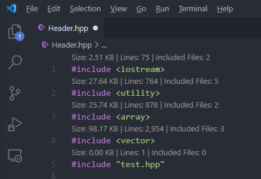
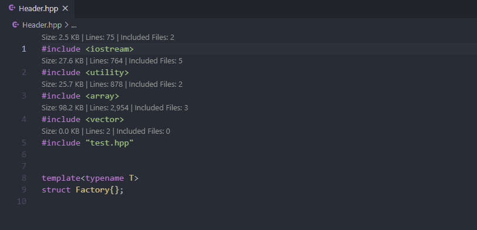

# include-info
Show info about your `<included>` files!

## Features
1. Show lines, file size and number of included files of your `#include <file>` directives. 

2. Directly jump to that file when clicked on the info.

## Requirements
A C++ language server, like [Microsoft's official C/C++ extension](https://marketplace.visualstudio.com/items?itemName=ms-vscode.cpptools) or [clangd](https://marketplace.visualstudio.com/items?itemName=llvm-vs-code-extensions.vscode-clangd).

## Extension Settings
This extension contributes the following settings:
- `Include Info.Auto Show Include Info`
- `Include Info.File Size Unit`
- `Include Info.File Size Decimal Digit`
- `Include Info.File Line Number Seperator`

## Known Issues
- Does NOT recursively scan the included files in the included file, because of [this vscode api issue I raised](https://github.com/microsoft/vscode/issues/118133) and [this](https://github.com/microsoft/vscode/issues/118085). (Code is already there, will update as soon as it get resolved.)
- Does NOT take conditional macros into account. Need significant effort to solve that, maybe using a real language server. (Contributions are greatly appreciated)

## Plan
- Add something like a tooltip that lists all the included files when clicked and jump to that file.
- Help remove unnecessary include (might need a language server)

## Release Notes
First release!